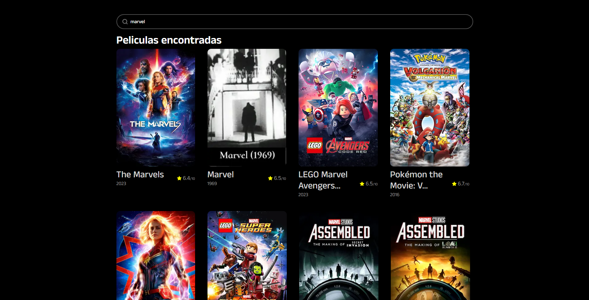

# Prueba de Codigo — Desarrollador Next.js

### Librerias:

- **zod** para los schemas del formulario.
- **react-hook-form** para gestionar el estado del formulario.
- **shadcn** para los componentes.
- **zustand** para almacenar de forma persistente el estado del formulario.
- **nextjs**
- **tanstack** para lograr un scroll infinito en los resultados de búsqueda.

### Tarea:

Implementa un input utilizando **shadcn** y **react-hook-form**. Este formulario debe validar el input utilizando un schema con **zod**, exigiendo un mínimo de 1 carácter y un máximo de 10 caracteres. En caso de error, se debe informar al usuario.

Cuando el usuario introduce un valor válido, se debe realizar una petición con **server actions** de nextjs para obtener películas que coincidan con el input. Los resultados deben presentarse con un scroll infinito implementado mediante **tanstack**.

Adicionalmente, utiliza zustand para almacenar de forma persistente tanto el valor del input como los resultados de la búsqueda, de manera que al recargar la página, los valores se mantengan.

# Resultados

- [x] Input con shadcn y react-hook-form
- [x] Validacion de input con Zod
- [x] Persistencia de estado
- [x] Peticion con server actions
- [x] Scroll infinito

#### Imagenes

